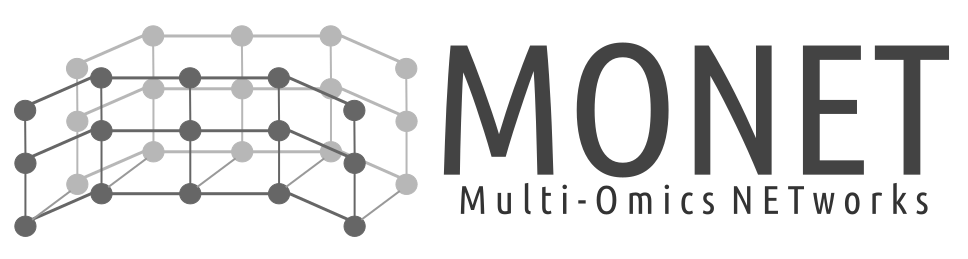

<p align="center"></p>
------


## Requirements

We use Docker to develop and manage MONET. We invite you to verify that the
following requirements are correctly satisfied before trying to bootstrap the
application:

* [Docker 1.12.6+](https://docs.docker.com/engine/installation/)

> We recommend you to follow Docker's official documentations to install
required docker tools (see links above).To help you, explanatory videos for each
operating system are available [here](https://www.bretfisher.com/installdocker/)

**Docker must be on for the duration of MONET use.**

## Quick start

Have you read the "Requirements" section above?

### MONET project installation

Download the zip file ([here](https://github.com/thomasdenecker/MONET/archive/master.zip)), extract this file and copy the obtained folder where you want on your computer. Note that if you move the folder, the installation procedure will have to be redone.

**Reminder** : Docker must always be switched on for any installation and use of MONET !

#### Windows installation 

**IMPORTANT** : MONET needs Docker. It will only be possible to install on **Windows 10**.

In this folder, you will find a file named INSTALLATION_WINDOWS.bat. By double clicking on it, the installation will begin. This may take a little time depending on the quality of your internet connection. When the installation is completed, a new file will appear. They allow to launch the MONET applications.

#### Mac OsX installation

**In command line**

[Open a terminal](https://www.youtube.com/watch?v=QROX039ckO8) and run these commands:

```
git clone https://github.com/thomasdenecker/MONET.git
cd MONET
sudo ./INSTALLATION_MAC.sh
```

The installation will begin. This may take a little time depending on the quality of your internet connection. When the installation is completed, a new file will appear. They allow to launch the MONET applications. Once the installation is complete, use this command to launch MONET:
```
./MONET.sh
```

**NOTE**

You can also double click the file MONET.sh. In this situation a small manipulation is required (only once). In the Finder, right-click the file MONET.sh and select "Open with" and then "Other...".

You can select the application you want the file to be execute with. In this case it should be the Terminal. To be able to select the Terminal, you have to switch from "Recommended Applications" to "All Applications"  (the Terminal.app application can be found in the Utilities folder).

Check "Always Open With" and after clicking OK you should be able to execute you SHELL script by simply double-clicking it.

#### Linux installation

**In command line**

[Open a terminal](https://linuxconfig.org/how-to-open-a-terminal-on-ubuntu-bionic-beaver-18-04-linux) and run these commands:

```
git clone https://github.com/thomasdenecker/MONET.git
cd MONET
sudo ./INSTALLATION_LINUX.sh
```
Once the installation is complete, use this command to launch MONET:
```
sudo ./MONET.sh
```

### MONET application utilisation

Double click on MONET file (Windows / MacOS X) or launch the command line (Linux) and open your internet browser, typing the following url http://localhost:3838/ and it should work.

**NOTE** (MAC users) : You may need to repeat the same manipulation as for the installation file (only once).

### Data to test application 

A dataset is available [here]('') . You can use it to see the file architecture and test the different options available. You can use column XXX for protein names, columns XXX to calculate a coexpression, columns XXX to colorate by quality score (p-value), columns XXX to change the node size (abundance) and columns XXX to colore by annotation.

## Development

### Launch in debug mode

During development, you will probably need to get all messages (errors, warnings and notifications) in the R terminal. The following command launches the application and generates a log file in the application folder. To find the path to the application, you can look in the launch file.

```
docker run -ti --rm -p 3838:3838 -v YOUR_APPLICATION_PATH:/var/log/shiny-server -v YOUR_APPLICATION_PATH:/srv/shiny-server tdenecker/monet
```

### Connect to a R session

```
docker run -ti --rm -p 3838:3838 -v YOUR_APPLICATION_PATH:/srv/shiny-server  tdenecker/monet
```

**Warning**: nothing is saved in this session (package installation, ...)


## Citation
If you use MONET project, please cite us :
Denecker et al, MONET - Multi-Omics NETworks, (2020), GitHub repository, https://github.com/thomasdenecker/MONET


## Contributing

Please, see the [CONTRIBUTING](CONTRIBUTING.md) file.

## Contributor Code of Conduct

Please note that this project is released with a [Contributor Code of
Conduct](http://contributor-covenant.org/). By participating in this project you
agree to abide by its terms. See [CODE_OF_CONDUCT](CODE_OF_CONDUCT.md) file.

## License

MONET is released under the BSD-3 License. See the bundled [LICENSE](LICENSE)
file for details.
